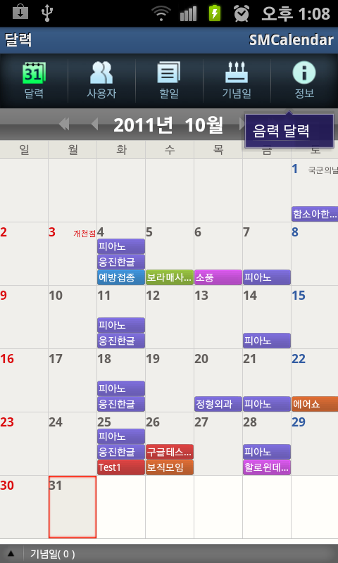

# SMCalendar Lite

Android calendar application developed in Java in 2011.

## Features

* Multi-person schedule management
* Lunar calendar support

## Technology

## Screenshots

## Service Status

* Service discontinued
* A separate paid version was also available
