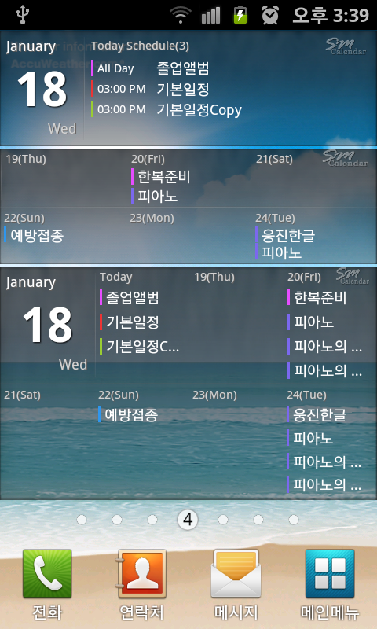
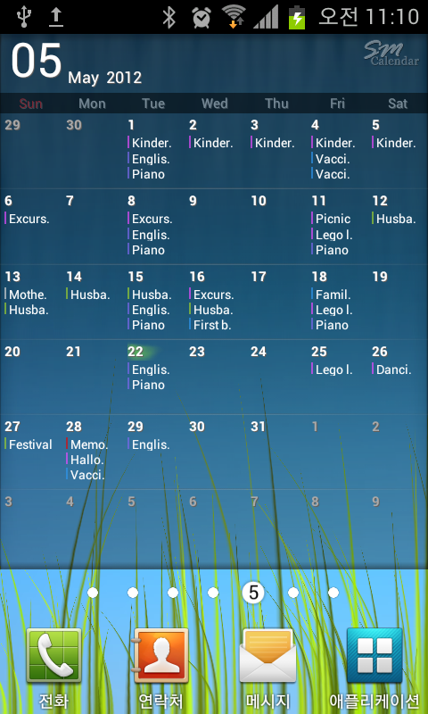
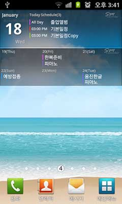

## SMCalendar Lite

Android calendar application developed in Java in 2011.

### Features

* Multi-person schedule management
* Lunar calendar support

### Technology

### Screenshots

<table>
  <tr>
    <td></td>
    <td></td>
    <td></td>
     <td></td>
  </tr> 
</table>

### Service Status

* Service discontinued
* A separate paid version was also available
